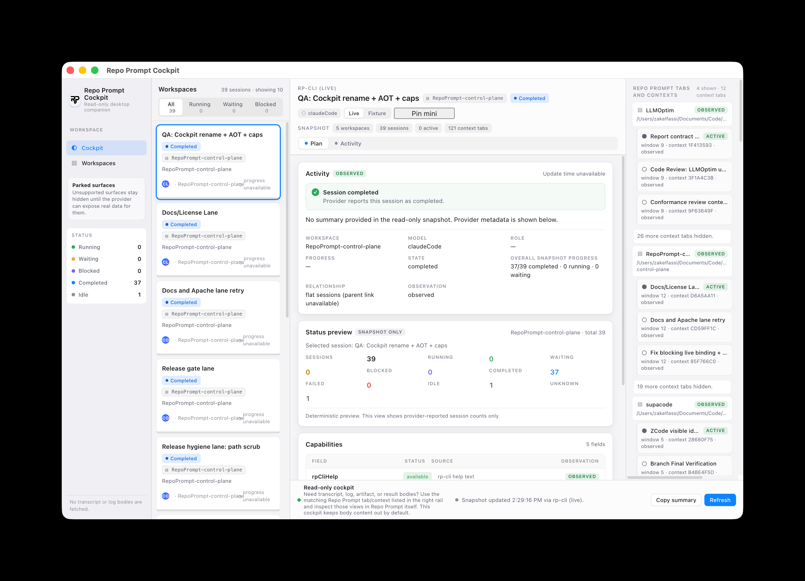
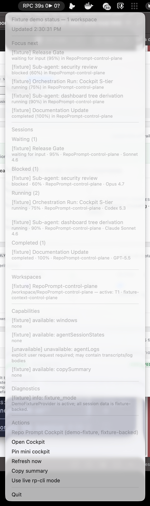

# Repo Prompt Cockpit

Repo Prompt Cockpit is a read-only desktop companion for [Repo Prompt](https://repoprompt.com/).

It gives you a high-signal control plane for live sessions, cross-workspace activity, sub-agent trees, workspace/context metadata, diagnostics, and a minimal always-on-top monitoring mode — without collecting transcript or log bodies by default.

The goal is not to replace Repo Prompt. The goal is to make Repo Prompt activity easier to monitor, demo, review, and discuss from outside the primary authoring surface.

## Preview

**Live desktop cockpit**

[](docs/images/preview-live-cockpit.png)

Click any image below to open it full size.

| Live mini cockpit | Demo desktop cockpit | Demo mini cockpit | Menu bar popup |
| --- | --- | --- | --- |
| [](docs/images/preview-live-mini.png) | [](docs/images/preview-demo-cockpit.png) | [](docs/images/preview-demo-mini.png) | [](docs/images/preview-menu-popup.png) |

## Origin

Repo Prompt Cockpit started from a simple operator problem: once I was running 6–7 Repo Prompt windows across multiple projects — often with more than one worktree per project — the bottleneck stopped being authoring and became monitoring.

This project began as a prototype to answer a practical question: how much of a useful monitoring surface could be built from Repo Prompt's existing signals, especially `rp-cli`, without trying to replace Repo Prompt itself?

## Why this exists

[Repo Prompt](https://repoprompt.com/) is the source of truth for context, selections, code maps, session state, and workflow execution.

Cockpit adds a complementary surface for things Repo Prompt itself does not currently emphasize in one compact external view:

- cross-workspace session awareness
- tray + desktop monitoring
- explicit sub-agent / workflow hierarchy
- observed vs inferred vs demo vs unavailable labeling
- deterministic demo mode
- privacy-first read-only summaries
- an always-on-top minimal monitoring window

## What feels novel here

This repo is most interesting where it **does not** try to clone Repo Prompt.

Instead, it experiments with a few product ideas on top of Repo Prompt state:

- **A real control-plane view** for watching multiple sessions across multiple workspaces.
- **A tray + cockpit pairing**: quick status in the menu bar, fuller state in a desktop window.
- **Session tree visibility**: parent orchestration runs, sub-agents, and workflow relationships shown explicitly when observed.
- **IDE/context visibility**: live workspace, tab, and context metadata surfaced as first-class operator signals.
- **Demo mode**: a deterministic review surface that does not need a live Repo Prompt install.

## What it is

- A read-only desktop companion for Repo Prompt operators and reviewers.
- A cockpit for session awareness, workflow status, context metadata, capability visibility, and diagnostics.
- A safe demo surface that can be exercised without a live Repo Prompt install by using bundled demo data.

## What it intentionally does not do

- It does **not** replace Repo Prompt or reimplement Repo Prompt's context engine.
- It does **not** write files, mutate Repo Prompt state, or perform agent actions through the provider.
- It does **not** collect transcripts, prompts, logs, artifacts, or chat history by default.
- It does **not** claim live availability when the Repo Prompt CLI binding is missing or unavailable.
- It does **not** make demo data look like live workspace truth.

## Current product shape

Cockpit currently supports:

- live `rp-cli` provider mode
- deterministic demo mode
- tray monitoring (`RPC …`) with compact grouped sections
- desktop cockpit window
- minimal always-on-top mode
- cross-workspace/process snapshot summary
- session cards and status filters
- sub-agent/session tree presentation
- Repo Prompt tab/context metadata
- capability and diagnostic reporting
- deterministic copy-summary output

## Privacy and read-only contract

The live provider is intended to inspect Repo Prompt state, not change it.

That contract is part of the product, not an implementation detail:

- provider integrations remain read-only
- unavailable states are shown truthfully instead of hidden
- transcript, prompt, artifact, and log body collection stays opt-in and is not enabled by default
- demo mode stays visibly demo-backed
- the deterministic copy-summary is metadata-only and bounded by `RP_CONTROL_PLANE_SUMMARY_MAX_CHARS` (default `1200`)
- no LLM calls are made unless explicitly configured; the shipped app does not wire one by default

## How to use

> Repo Prompt Cockpit currently ships as an unsigned macOS preview build.

1. Download the latest `.dmg` or `.zip` from [GitHub Releases](https://github.com/zakelfassi/repo-prompt-cockpit/releases/latest).
2. Open the `.dmg` or unzip the archive.
3. Drag **Repo Prompt Cockpit.app** to Applications, or run it from the extracted folder.
4. On first launch, macOS may warn that the app is from an unidentified developer. Use right-click → **Open** to confirm you want to launch it.

If macOS quarantine blocks an internal test machine, remove quarantine explicitly:

```bash
xattr -dr com.apple.quarantine /Applications/Repo\ Prompt\ Cockpit.app
```

With Repo Prompt running, Cockpit starts in live mode and shows observed workspace/session metadata from `rp-cli`. If live binding is unavailable, switch to demo mode from the tray menu to verify the desktop cockpit, mini mode, tray menu, and copy-summary flow with deterministic demo data.

Cockpit is unsigned and not notarized today. That is expected for the preview release path; Gatekeeper may still warn even though the local package script ad-hoc signs the app bundle for codesign integrity.

## How to build locally / contribute

Install dependencies:

```bash
pnpm install
```

Run with the live Repo Prompt provider:

```bash
pnpm dev
```

Run with deterministic demo mode:

```bash
RP_CONTROL_PLANE_DEMO=1 pnpm dev
```

Demo mode is the safest path for screenshots, previews, and review when a live Repo Prompt binding is not available.

Build local unsigned macOS preview artifacts:

```bash
pnpm package:mac
```

That command runs the TypeScript build, assembles `Repo Prompt Cockpit.app` from the installed Electron runtime, ad-hoc signs the preview bundle, and writes artifacts to `release/`:

- `release/mac-preview/Repo Prompt Cockpit.app` — local app bundle for quick testing
- `release/Repo Prompt Cockpit-<version>-mac-<arch>.zip` — shareable zip

For a fast app-bundle-only smoke pass, or a disk image, run:

```bash
pnpm package:mac:app  # app bundle only
pnpm package:mac:dmg  # app bundle, zip, and dmg when hdiutil is available
```

The DMG build stages the app with macOS bundle-preserving copy semantics and validates the staged executable, Electron ICU resource, and ad-hoc signature before creating the disk image. The GitHub Actions workflow **macOS Preview Package** can also be run manually from the Actions tab. It runs `pnpm verify`, builds the same unsigned macOS preview artifacts including the DMG, and uploads them as workflow artifacts.

## Useful environment variables

| Var | Default | Purpose |
| --- | --- | --- |
| `RP_CLI_PATH` | `rp-cli` | Override the `rp-cli` binary path. |
| `RP_CONTROL_PLANE_DEMO` | `0` | `1` forces demo mode. |
| `RP_CONTROL_PLANE_POLL_MS` | `15000` | Polling interval. |
| `RP_CONTROL_PLANE_STALE_MINUTES` | `30` | When to mark a session stale. |
| `RP_CONTROL_PLANE_SUMMARY_MAX_CHARS` | `1200` | Hard cap on the deterministic summary. |
| `RP_CONTROL_PLANE_OPEN_WINDOW` | `1` | `0` keeps the cockpit window closed at launch. |
| `RP_CONTROL_PLANE_WINDOW_WIDTH` | `1280` | Desktop cockpit width. |
| `RP_CONTROL_PLANE_WINDOW_HEIGHT` | `860` | Desktop cockpit height. |
| `RP_CONTROL_PLANE_MINIMAL_WINDOW_WIDTH` | `540` | Minimal mode width. |
| `RP_CONTROL_PLANE_MINIMAL_WINDOW_HEIGHT` | `620` | Minimal mode height. |
| `RP_CONTROL_PLANE_ENABLE_LLM` | `0` | Reserved; LLM summaries are not implemented and never default-on. |

## Where to inspect body content

Cockpit deliberately keeps transcript/log/artifact/result bodies out of the desktop UI by default.

If you need body-level detail:

1. Use the **Repo Prompt tabs and contexts** section in Cockpit to identify the matching workspace, tab, and context.
2. Switch to that session inside Repo Prompt itself.
3. Inspect Logs / Results / Artifacts there.

Repo Prompt remains the source of truth for those deeper views.

## Contributor verification

Before opening a PR, run:

```bash
pnpm verify
```

For targeted checks, these are also wired:

```bash
pnpm probe:rp                # live rp-cli probe + snapshot + summary
pnpm smoke:menu              # tray menu shape from demo data
pnpm smoke:dashboard         # dashboard derivation from demo data
pnpm smoke:missing-rp-cli    # negative: rp-cli missing
pnpm smoke:socket-denied     # negative: Repo Prompt socket permission denied
pnpm smoke:binding-target    # multi-window binding behavior
pnpm smoke:tray              # Electron tray smoke in demo mode
```

Negative smokes are part of the gate, not optional, when provider code changes.

## Relationship to Repo Prompt

This repository is an independent companion UI experiment for [Repo Prompt](https://repoprompt.com/).

Repo Prompt itself remains the canonical product and the source of truth for workflow execution, context, logs, results, and permissions. Cockpit is a separate read-only monitoring and presentation layer built around that ecosystem.

## Brand note

This repository references the Repo Prompt product because it is the upstream system this cockpit targets. For the official product and primary experience, visit [repoprompt.com](https://repoprompt.com/).

## License

Apache-2.0.

That choice is deliberate: permissive, easy to consume, and clearer for team/company reuse than MIT in contexts where upstream/internal adoption is likely.

## Release scope

This repository is ready for source use and unsigned macOS preview releases.

Supported workflows today:

- download the latest unsigned macOS `.dmg` / `.zip` from [GitHub Releases](https://github.com/zakelfassi/repo-prompt-cockpit/releases/latest)
- `pnpm dev` for local development
- `pnpm verify` before opening or merging changes
- `pnpm package:mac` / `pnpm package:mac:dmg` for local unsigned macOS preview builds; the DMG path validates the staged app before image creation

Developer ID signing, hardened runtime, notarization, auto-update, and fully trusted macOS distribution are follow-on work.
