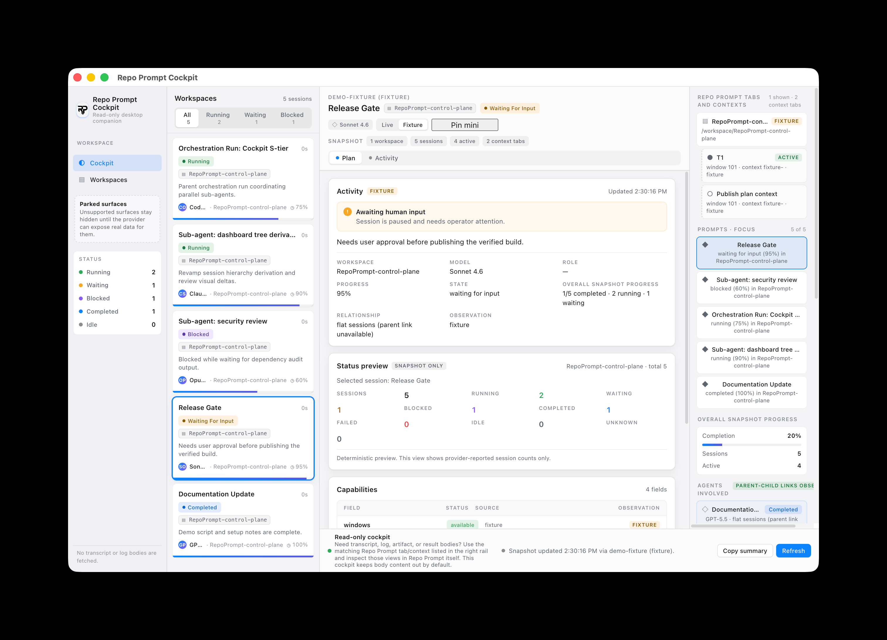
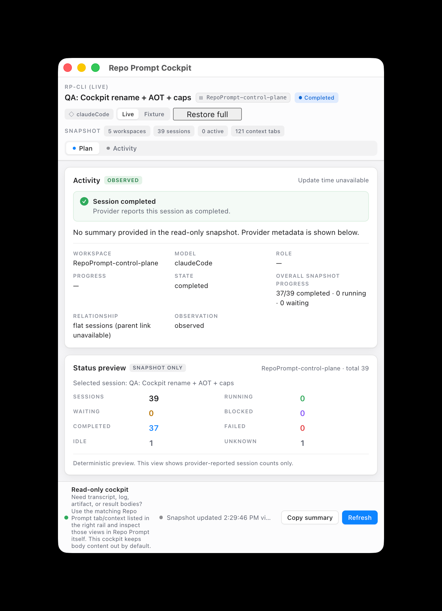
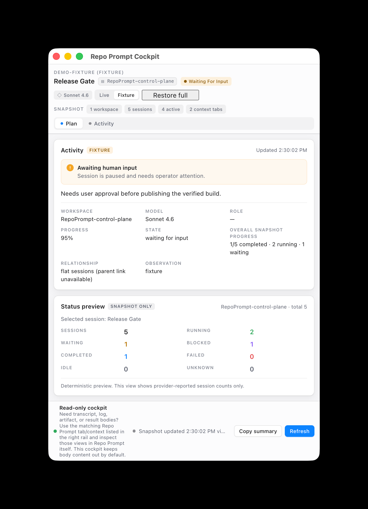

# Repo Prompt Cockpit

Repo Prompt Cockpit is a read-only desktop companion for Repo Prompt.

It gives you a high-signal control plane for live sessions, cross-workspace activity, sub-agent trees, workspace/context metadata, diagnostics, and a minimal always-on-top monitoring mode — without collecting transcript or log bodies by default.

The goal is not to replace Repo Prompt. The goal is to make Repo Prompt activity easier to monitor, demo, review, and discuss from outside the primary authoring surface.

## Preview

**Live desktop cockpit**

[](docs/images/cockpit-desktop-live.png)

Click any image below to open it full size.

| Live minimal mode | Fixture desktop cockpit | Fixture minimal mode |
| --- | --- | --- |
| [](docs/images/cockpit-minimal-live.png) | [](docs/images/cockpit-desktop-fixture.png) | [](docs/images/cockpit-minimal-fixture.png) |

## Why this exists

Repo Prompt is the source of truth for context, selections, code maps, session state, and workflow execution.

Cockpit adds a complementary surface for things Repo Prompt itself does not currently emphasize in one compact external view:

- cross-workspace session awareness
- tray + desktop monitoring
- explicit sub-agent / workflow hierarchy
- observed vs inferred vs fixture vs unavailable labeling
- deterministic demo mode
- privacy-first read-only summaries
- an always-on-top minimal monitoring window

## What feels novel here

This repo is most interesting where it **does not** try to clone Repo Prompt.

Instead, it experiments with a few product ideas on top of Repo Prompt state:

- **A real control-plane view** for watching multiple sessions across multiple workspaces.
- **A tray + cockpit pairing**: quick status in the menu bar, fuller state in a desktop window.
- **Session tree visibility**: parent orchestration runs, sub-agents, and workflow relationships shown explicitly when observed.
- **IDE/context visibility**: live workspace, tab, and context metadata surfaced as first-class operator signals.
- **Fixture mode**: a deterministic demo/review surface that does not need a live Repo Prompt install.
- **Honesty-first unavailable UX**: unsupported views are parked or explained instead of faked.

## What it is

- A read-only desktop companion for Repo Prompt operators and reviewers.
- A cockpit for session awareness, workflow status, context metadata, capability visibility, and diagnostics.
- A safe demo surface that can be exercised without a live Repo Prompt install by using bundled fixtures.

## What it intentionally does not do

- It does **not** replace Repo Prompt or reimplement Repo Prompt's context engine.
- It does **not** write files, mutate Repo Prompt state, or perform agent actions through the provider.
- It does **not** collect transcripts, prompts, logs, artifacts, or chat history by default.
- It does **not** claim live availability when the Repo Prompt CLI binding is missing or unavailable.
- It does **not** make fixture data look like live workspace truth.

## Current product shape

Cockpit currently supports:

- live `rp-cli` provider mode
- deterministic fixture/demo mode
- tray monitoring (`RPC …`) with compact grouped sections
- desktop cockpit window
- minimal always-on-top mode
- cross-workspace/process snapshot summary
- session cards and status filters
- sub-agent/session tree presentation
- Repo Prompt tab/context metadata
- capability and diagnostic reporting
- deterministic copy-summary output

## Privacy and read-only contract

The live provider is intended to inspect Repo Prompt state, not change it.

That contract is part of the product, not an implementation detail:

- provider integrations remain read-only
- unavailable states are shown truthfully instead of hidden
- transcript, prompt, artifact, and log body collection stays opt-in and is not enabled by default
- fixture mode stays visibly fixture-backed
- the deterministic copy-summary is metadata-only and bounded by `RP_CONTROL_PLANE_SUMMARY_MAX_CHARS` (default `1200`)
- no LLM calls are made unless explicitly configured; the shipped app does not wire one by default

## Running the app

Install dependencies:

```bash
pnpm install
```

Run with the live Repo Prompt provider:

```bash
pnpm dev
```

Run with deterministic fixtures:

```bash
RP_CONTROL_PLANE_DEMO=1 pnpm dev
```

Fixture mode is the safest path for demos, screenshots, and review when a live Repo Prompt binding is not available.

## Useful environment variables

| Var | Default | Purpose |
| --- | --- | --- |
| `RP_CLI_PATH` | `rp-cli` | Override the `rp-cli` binary path. |
| `RP_CONTROL_PLANE_DEMO` | `0` | `1` forces the fixture provider. |
| `RP_CONTROL_PLANE_POLL_MS` | `15000` | Polling interval. |
| `RP_CONTROL_PLANE_STALE_MINUTES` | `30` | When to mark a session stale. |
| `RP_CONTROL_PLANE_SUMMARY_MAX_CHARS` | `1200` | Hard cap on the deterministic summary. |
| `RP_CONTROL_PLANE_OPEN_WINDOW` | `1` | `0` keeps the cockpit window closed at launch. |
| `RP_CONTROL_PLANE_WINDOW_WIDTH` | `1280` | Desktop cockpit width. |
| `RP_CONTROL_PLANE_WINDOW_HEIGHT` | `860` | Desktop cockpit height. |
| `RP_CONTROL_PLANE_MINIMAL_WINDOW_WIDTH` | `540` | Minimal mode width. |
| `RP_CONTROL_PLANE_MINIMAL_WINDOW_HEIGHT` | `620` | Minimal mode height. |
| `RP_CONTROL_PLANE_ENABLE_LLM` | `0` | Reserved; LLM summaries are not implemented and never default-on. |

## Where to inspect body content

Cockpit deliberately keeps transcript/log/artifact/result bodies out of the desktop UI by default.

If you need body-level detail:

1. Use the **Repo Prompt tabs and contexts** section in Cockpit to identify the matching workspace/tab/context.
2. Switch to that session inside Repo Prompt itself.
3. Inspect Logs / Results / Artifacts there.

Repo Prompt remains the source of truth for those deeper views.

## Verification

Before opening a PR, run:

```bash
pnpm verify
```

For targeted checks, these are also wired:

```bash
pnpm probe:rp                # live rp-cli probe + snapshot + summary
pnpm smoke:menu              # tray menu shape from fixture data
pnpm smoke:dashboard         # dashboard derivation from fixture data
pnpm smoke:missing-rp-cli    # negative: rp-cli missing
pnpm smoke:socket-denied     # negative: RepoPrompt socket permission denied
pnpm smoke:binding-target    # multi-window binding behavior
pnpm smoke:tray              # Electron tray smoke in fixture mode
```

Negative smokes are part of the gate, not optional, when provider code changes.

## License

Apache-2.0.

That choice is deliberate: permissive, easy to consume, and clearer for team/company reuse than MIT in contexts where upstream/internal adoption is likely.

## Source release scope

This repository is currently prepared as a **source release**, not a signed desktop distribution.

Supported workflows today:

- `pnpm dev`
- `pnpm verify`

Packaging, code signing, and notarization are follow-on work.
